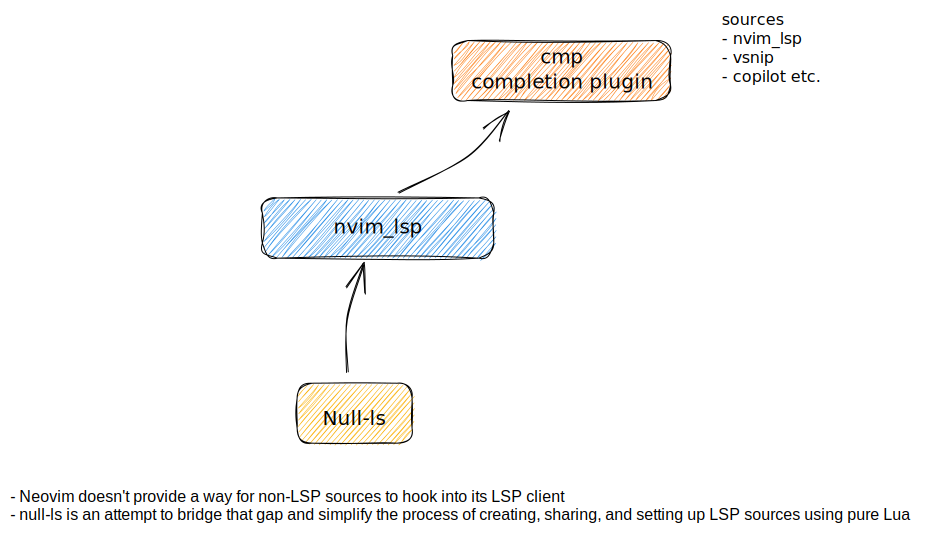
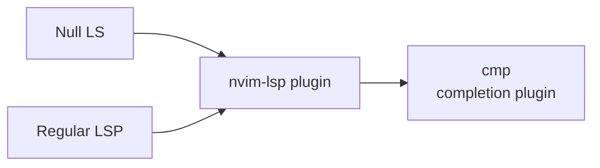

# 📺 Nix based dotfiles

## Setup

### Nix
```shell
sh <(curl -L https://nixos.org/nix/install)
```
### home-manager
```shell
export NIX_PATH=$HOME/.nix-defexpr/channels:/nix/var/nix/profiles/per-user/root/channels${NIX_PATH:+:$NIX_PATH}
nix-shell '<home-manager>' -A install
```

Symlink `nixfiles` to `~/.config/nixpkgs`
```
 ln -s ~/dev/dotfiles/nixfiles ~/.config/home-manager
```
### nix-darwin
Have services etc configured with nix

On [github](https://github.com/LnL7/nix-darwin)

## Help

### Fix Post MacOS upgrade
re-add in `/etc/zshrc`
```
# Nix
if [ -e '/nix/var/nix/profiles/default/etc/profile.d/nix-daemon.sh' ]; then
  source '/nix/var/nix/profiles/default/etc/profile.d/nix-daemon.sh'
fi
# End Nix
```

## BAU commands


Update environment and deps with

```shell
make update
```

Apply changes to home-manager config

```shell
make
```

Prefetch a package

```shell
nix-prefetch-git url
```

**protip**: to figure sha256, can also run `make` with a wrong sha and it will give the right one

## Neovim

### Languages Support

Languages are being supported in NeoVim with few tools, `tree-sitter`, `cmp` and `nvim_lsp`





### Shortcuts

### tips

Search + Replace all and save
```
 Telescope Grep to find the string project wise, CTRL+Q to add them all to the Quickfix list and then ‘:cdo s/StringOne/StringTwo/g | update’
```

#### Completion - CMP

```
ctrl+space -> complete
ctrl+b -> scroll docs up
ctrl+f -> scroll docs down
enter -> confirm
```

#### LSP

Default behaviour of Ctrl n comes from that, we overload it inside cmp settings

[Improve completion popup menu | Vim Tips Wiki | Fandom](https://vim.fandom.com/wiki/Improve_completion_popup_menu)

```
H -> Hover information
gt -> Type definition
gs -> Signature
gd -> Definition
gr -> References

```

## Nix flakes config

Added a config file in ~/.config/nix/nix.conf

```nix
experimental-features = nix-command flakes
```

## Condas


Python distro

### install opts
miniconda install for apple silicon (to be able to run tensorflow), not handled
by nix/dotfiles for now, easier is to install miniforge, see this article
https://caffeinedev.medium.com/how-to-install-tensorflow-on-m1-mac-8e9b91d93706


### commands


```
# update conda itself
conda update -n base conda

# create an env 
conda create -n <env> python=3.10

# update all package 
conda update --all

# select a conda env 
conda activate <env>

# deactivate
conda deactivate

# Install package
conda install -n mlpy311 numpy --update-deps --force-reinstall
conda install -n <env> numpy --update-deps --force-reinstall


```


## IAM & AWS

`aws-infra` directory for the dets

Bootstrap `terraform` backend to store states and lockfiles of tf resources.
The backend is in `s3` + `dynamodb`
[tf-backend](aws-infra/tf-backend/README.md)

Additional resources created in `/tf-misc`
[tf-misc](aws-infra/tf-misc/tfdocs.md)

## Tmux

### Keys

Select sessions named such as `<M-a>` in tmux sessions list selection.
We change the profile in iterm2 keys> keys config

```
Right option key : Esc+
```

## Fonts

[Github](https://github.com/ryanoasis/nerd-fonts#option-9-patch-your-own-font)

Patch fonts for glyph like so
```
docker run --rm -v ~/dev/dotfiles/fonts/in:/in -v  ~/dev/dotfiles/fonts/out:/out nerdfonts/patcher
```

### SFMono
[Gh](https://github.com/shaunsingh/SFMono-Nerd-Font-Ligaturized)

## Tile Manager

Yabai installed, launch it with `yabai`. 
Config ideas here https://bryce-s.com/yabai/

## Todos

- Fix gist vim & remove gists
- Tweak lsp mappings (refactoring & code actions?)
- Conventional commit tooling, look at nvim/after/ftplugin/gitcommit.lua and add a cli? Cocogitto? https://github.com/cocogitto/cocogitto seehttps://golangexample.com/command-line-tool-to-help-you-use-conventional-commit-messages/ if cz flaky
- Lsp for protobuf https://github.com/neovim/nvim-lspconfig/blob/master/doc/server_configurations.md#bufls
- explore https://golangexample.com/command-line-tool-to-help-you-use-conventional-commit-messages/ if cz flaky
- Use `niv` to check-in dependencies (home-manager & nixpkgs) versions [GitHub - ryantm/home-manager-template: A quick-start template for using home-manager in a more reproducible way.](https://github.com/ryantm/home-manager-template) [How I Nix](https://eevie.ro/posts/2022-01-24-how-i-nix.html)
- [latexindent](https://tex.stackexchange.com/questions/390433/how-can-i-install-latexindent-on-macos)
- configure friendly snip (rails...)
- Look at latex editor config with preview (saved in Pocket)
- editorconfig xdg
- markdown formatter
- switch algo for rsa key to ed25519
- test mermerd https://github.com/KarnerTh/mermerd
- install nix-darwin & start services like lorri/yabai
- https://github.com/danymat/neogen
- chatgpt plugin?
