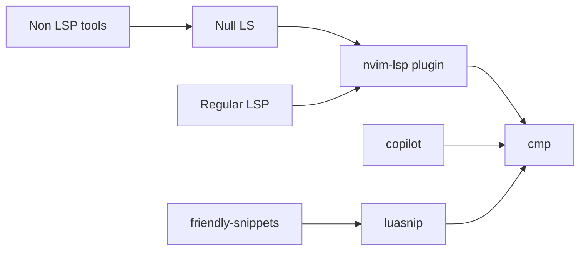

# 📺 Machines configurations

<!--toc:start-->
- [Setup](#setup)
- [Neovim](#neovim)
  - [Languages](#languages)
  - [Ruby](#ruby)
- [Mise(-en-place)](#mise-en-place)
- [Gist](#gist)
  - [Reminders/mappings](#remindersmappings)
- [Tmux](#tmux)
  - [Keys](#keys)
- [Fonts](#fonts)
- [Todos](#todos)
<!--toc:end-->

---

Using nix-darwin, home-manager, neovim and a few others tools

## Setup 
- Install [nix with installer](https://github.com/DeterminateSystems/nix-installer) 
```shell
curl --proto '=https' --tlsv1.2 -sSf -L https://install.determinate.systems/nix | sh -s -- install
```
- Clone this repo and run `make` in it

## Neovim

### Languages 
- tree-sitter: syntax support for most languages
- cmp: completion plugin (tap into nvim-lsp, copilot, snippets engines etc.)
- nvim-lsp: support for language server protocol, install them individually
- null-ls: support for non-lsp tools to hook into the lsp client 


### Ruby

Why the current setup:

- `withRuby=false` so neovim does not create its own ruby environment, but rather use mise (local or global). Note that mason also comes with its own ruby env if needs
- `=true` would install a ruby in nix store, when installing stuff from wihin neovim it would try to write to that nix store location and fail
- in neovim type `:!gem env` to see whats exactly loaded. 
- However mise installed ruby does not ship with `neovim` gem out of the box, it needs to be installed on every new version. Luckily [mise]() comes with that option with a file `~/.default-gems`, see `mise.nix` and that file in `dotfiles/`


### exrc

Example, changing colorscheme and setting up a lsp natively bypassing mason
(ruby_lsp intalled in Gemfile or in ~/.default-gems).
```
# .nvim.lua
vim.cmd("colorscheme catppuccin")
require("lspconfig").ruby_lsp.setup({})
```

## Mise(-en-place)

[mise-en-place](https://mise.jdx.dev/dev-tools/shims.html)
use `mise ls` to list currently installed language

add shims directory to path so lsp etc are not lost
`mise activate --shims`


## Gist

`!h gist-vim` for help, tldr add a `~/.gist-vim` with `token xxx` in it, token
from gh with gist scope

### Reminders/mappings
Search + Replace all and save
> Telescope Grep to find the string project wise, CTRL+Q to add them all to the Quickfix list and then ‘:cdo s/StringOne/StringTwo/g | update’

__Cmp__
```
ctrl+space -> complete
ctrl+b -> scroll docs up
ctrl+f -> scroll docs down
enter -> confirm
```

__LSP__
Default behaviour of Ctrl n comes from that, we overload it inside cmp settings
[Improve completion popup menu | Vim Tips Wiki | Fandom](https://vim.fandom.com/wiki/Improve_completion_popup_menu)
```
H -> Hover information
gt -> Type definition
gs -> Signature
gd -> Definition
gr -> References
ca -> Code action
```


## Tmux

### Keys

Select sessions named such as `<M-a>` in tmux sessions list selection.
We change the profile in iterm2 keys> keys config

```
Right option key : Esc+
```

## Fonts

[Github](https://github.com/ryanoasis/nerd-fonts#option-9-patch-your-own-font)
Patch fonts for glyph like so
```
docker run --rm -v ~/dev/dotfiles/fonts/in:/in -v  ~/dev/dotfiles/fonts/out:/out nerdfonts/patcher
```

## Todos

- [ ] Conventional commit tooling, look at nvim/after/ftplugin/gitcommit.lua and add a cli? Cocogitto? https://github.com/cocogitto/cocogitto seehttps://golangexample.com/command-line-tool-to-help-you-use-conventional-commit-messages/ if cz flaky
- [ ] https://github.com/kristijanhusak/vim-dadbod-completion
- [ ] Look at latex editor config with preview (saved in Pocket)
- [ ] Switch tooling for python to Ruff? (lsp, formatting code acsh etc)
- [ ] [latexindent](https://tex.stackexchange.com/questions/390433/how-can-i-install-latexindent-on-macos)
- [ ] editorconfig xdg https://specifications.freedesktop.org/basedir-spec/basedir-spec-latest.html
- [ ] explore https://golangexample.com/command-line-tool-to-help-you-use-conventional-commit-messages/ if cz flaky
- [ ] https://github.com/danymat/neogen vs chatgpt plugin
- [ ] https://neovimcraft.com/plugin/tadmccorkle/markdown.nvim/
- [ ] markdown formatter
- [ ] neovim-devdocs
- [ ] switch algo for rsa key to ed25519
- [ ] ~~Lsp for protobuf https://github.com/neovim/nvim-lspconfig/blob/master/doc/server_configurations.md#bufls~~
- [ ] [proselint]()
- [ ] folds
- [ ] yanky
- [ ] explore kickstart.nvim 

### Refacto happening

- Neovim config

#### Kickstart
- [x] Neotree ? included or byo
- [x] Mason lsp on a per project, currently it starts both ruby and solargraph :/
- [ ] Figure some mappings 
  - [x] Switch buffers leaderleader
  - [x] Open NeoTree
  - [x] Previous buffer
- [ ] ~~Added kickstarter as a submodule~~
```shell
git submodule add https://github.com/albandiguer/kickstart.nvim.git ./home/programs/kickstart-nvim/nvim/
```
=> although the idea is decent, in practice not good as for nix to work you need to check in changes in main git, related to derivation?
- [x] Markdown preview
- [x] Dadbod
- [x] vim-dadbod-completion
- [x] Colorschemes
- [ ] Filetype plugins
- [ ] Code sideproject couple hours to get a hand of it
- [x] Bookmarks
- [x] Dispatch
- [ ] Fugitive
- [ ] luasnip
- [ ] copilot

<details><summary>Done</summary>

- [x] Give a try to [lazyvim](https://github.com/LazyVim/LazyVim/)?
- [x] Cleanup gists
- [x] Configure fish and switch to it, bug with sensible-on-top switching back to /bin/zsh
- [x] Fix gist vim 
- [x] Give a try to [lazyvim](https://github.com/LazyVim/LazyVim/)?
- [x] Raycast
- [x] SFMono [Gh](https://github.com/shaunsingh/SFMono-Nerd-Font-Ligaturized)
- [x] Tweak lsp mappings (refactoring & code actions?)
- [x] branch -> mutli platform flake
- [x] configure friendly snippets (rails...)
- [x] evaluate vsnips vs luasnip
- [x] get nvim from nighty builds overlay (0.10+)
- [x] install nix-darwin & start services like skhd/yabai
- [x] obsidian neovim https://github.com/epwalsh/obsidian.nvim
- [x] test mermerd https://github.com/KarnerTh/mermerd -> good, add it on pproject basis
- [x] tester ~devenv~ mise for python/ruby
- [x] ~~Use `niv` to check-in dependencies (home-manager & nixpkgs) versions [GitHub - ryantm/home-manager-template: A quick-start template for using home-manager in a more reproducible way.](https://github.com/ryantm/home-manager-template) [How I Nix](https://eevie.ro/posts/2022-01-24-how-i-nix.html)~~ -> flake

</details>
