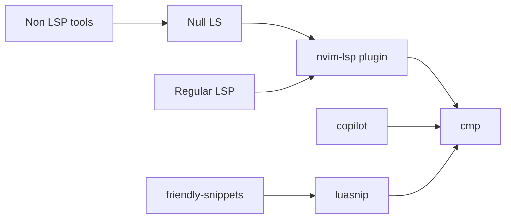

# Neovim

## Languages 
- tree-sitter: syntax support for most languages
- cmp: completion plugin (tap into nvim-lsp, copilot, snippets engines etc.)
- nvim-lsp: support for language server protocol, install them individually
- null-ls: support for non-lsp tools to hook into the lsp client 


## Ruby

Why the current setup:

- `withRuby=false` so neovim does not create its own ruby environment, but rather use mise (local or global). Note that mason also comes with its own ruby env if needs
- `=true` would install a ruby in nix store, when installing stuff from wihin neovim it would try to write to that nix store location and fail
- in neovim type `:!gem env` to see whats exactly loaded. 
- However mise installed ruby does not ship with `neovim` gem out of the box, it needs to be installed on every new version. Luckily [mise]() comes with that option with a file `~/.default-gems`, see `mise.nix` and that file in `dotfiles/`
- Add `ruby-lsp` in default-gems as well, can then have the following in `.nvim.lua` file inside the project to have ruby-lsp at work
```
require("lspconfig").ruby_lsp.setup({
	cmd = { "mise", "x", "--", "ruby-lsp" },
	init_options = {
		formatter = "standard",
		linters = { "standard" },
	},
})
vim.cmd.colorscheme("melange")
```


## Molten
to add a virtualenv and a kernel for molten use `mise task run molten-setup` (see mise config)

```fish
# activate venv
source ~/.virtualenvs/molten/bin/activate.fish
# list pkgs
uv pip list
# deactivate
deactivate
```


## exrc

Example, changing colorscheme and setting up a lsp natively bypassing mason
(ruby_lsp intalled in Gemfile or in ~/.default-gems).
```
# .nvim.lua
vim.cmd("colorscheme catppuccin")
require("lspconfig").ruby_lsp.setup({})
```


## TODOs
- [ ] Conventional commit tooling, look at nvim/after/ftplugin/gitcommit.lua and add a cli? Cocogitto? https://github.com/cocogitto/cocogitto seehttps://golangexample.com/command-line-tool-to-help-you-use-conventional-commit-messages/ if cz flaky
- [ ] https://github.com/kristijanhusak/vim-dadbod-completion
- [ ] Look at latex editor config with preview (saved in Pocket)
- [ ] https://neovimcraft.com/plugin/tadmccorkle/markdown.nvim/
- [ ] markdown formatter
- [ ] neovim-devdocs
- [ ] [latexindent](https://tex.stackexchange.com/questions/390433/how-can-i-install-latexindent-on-macos)
- [ ] explore https://golangexample.com/command-line-tool-to-help-you-use-conventional-commit-messages/ if cz flaky
- [ ] [proselint]()
- [ ] folds
- [ ] yanky
- [x] explore kickstart.nvim 
- [ ] obsidian neovim https://github.com/epwalsh/obsidian.nvim
- Neovim config

#### Kickstart
- [x] Neotree ? included or byo
- [x] Mason lsp on a per project, currently it starts both ruby and solargraph :/
- [x] Figure some mappings 
  - [x] Switch buffers leaderleader
  - [x] Open NeoTree
  - [x] Previous buffer
- [ ] ~~Added kickstarter as a submodule~~
```shell
git submodule add https://github.com/albandiguer/kickstart.nvim.git ./home/programs/kickstart-nvim/nvim/
```
=> although the idea is decent, in practice not good as for nix to work you need to check in changes in main git, related to derivation?
- [x] Markdown preview
- [ ] Dadbod
- [x] vim-dadbod-completion
- [x] Colorschemes
- [x] Filetype plugins
- [x] Bookmarks
- [x] Dispatch
- [x] Fugitive
- [x] luasnip
- [x] copilot
- [ ] prob with git amend 
- [ ] Code sideproject couple hours to get a hand of it
- [x] Give a try to [lazyvim](https://github.com/LazyVim/LazyVim/)?
- [x] Fix gist vim 
- [x] Tweak lsp mappings (refactoring & code actions?)
- [x] configure friendly snippets (rails...)
- [x] evaluate vsnips vs luasnip
- [x] get nvim from nighty builds overlay (0.10+)
- [ ] ~~Lsp for protobuf https://github.com/neovim/nvim-lspconfig/blob/master/doc/server_configurations.md#bufls~~
